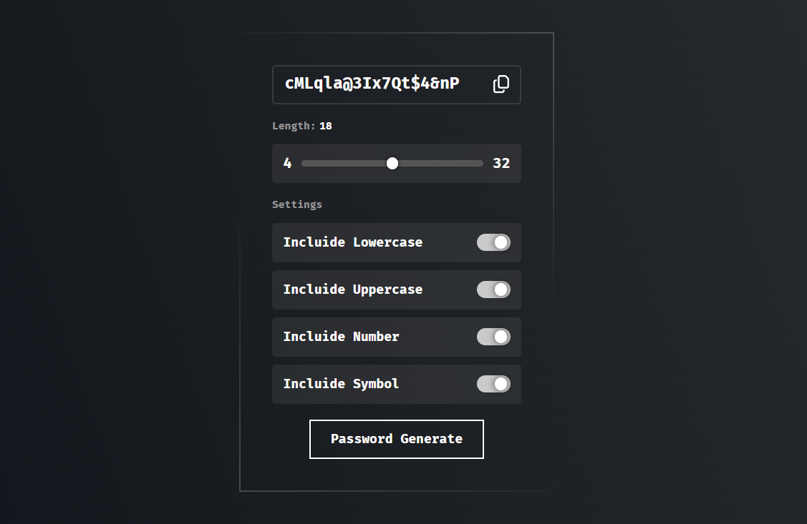

<h2 align="center">
    Password Generator
<h2>

<p align="center">
  <a href="#-projeto">Projeto</a>&nbsp;&nbsp;&nbsp;|&nbsp;&nbsp;&nbsp;
  <a href="#-como-rodar-o-projeto">Como rodar o projeto</a>&nbsp;&nbsp;&nbsp;|&nbsp;&nbsp;&nbsp;
  <a href="#-tecnologias">Tecnologias</a>&nbsp;&nbsp;&nbsp;|&nbsp;&nbsp;&nbsp;
  <a href="#-design">Desgin</a>&nbsp;&nbsp;&nbsp;|&nbsp;&nbsp;&nbsp;
  <a href="#-demo">Demo</a>&nbsp;&nbsp;&nbsp;|&nbsp;&nbsp;&nbsp;
  <a href="#-licença">Licença</a>
</p>

## 💻 Projeto

Este pequeno projeto foi para testar algumas habilidades para montar um front-end, idealizando um gerador de senhas "simples", com algumas configurações e funcionalidades que você pode ver abaixo:

- [x] Determinar o tamanho da senha.
- [x] Determinar se a senha terá letras minúsculas e maiúsculas.
- [x] Determinar se a senha terá números e símbolos.
- [x] Um botão para copiar a senha gerada.


### 📸 Imagem

**Tela para criar senha**


## 🧭 Como rodar o projeto

**Clone este repositório**

```bash
git clone https://github.com/Pol4rLun4r/password-generator
```

**Acesse a pasta**

```bash
cd password-generator
```

**Instale as dependências**

```bash
npm install
```

**Execute a aplicação para Desenvolvimento**

- aqui você estará rodando o projeto para desenvolvimento.

```bash
npm run dev
```

**Execute a aplicação para Visualização**

- aqui você estará rodando o projeto todo pronto, sem formas de editar, apenas usar o mesmo.

```bash
npm run build
```
```bash
npm run preview
```

## 🚀 Tecnologias

Esse projeto foi desenvolvido com as seguintes tecnologias:

- [ReactJS](https://pt-br.reactjs.org)
  - usado como framework, a base do projeto foi feita também junto com [typescript](https://www.typescriptlang.org/).
- [FramerMotion](https://www.framer.com/motion/)
  - usado para fazer as animações fluidas dos elementos da tela.
- [GlitchedWriter](https://github.com/thetarnav/glitched-writer)
  - usado para a animação ao gerar o código.
- [StyledComponents](https://styled-components.com/docs)
  - usado para montar todo o css/estilo do projeto.
- [ReactResponsive](https://www.npmjs.com/package/react-responsive)
  - usado unicamente para mostrar a mensagem de não "suportado" ao ter uma tela com a largura menor que 320px.
- [VitePluginVSGR](https://www.npmjs.com/package/vite-plugin-svgr)
  - usado para colocar o ícones no projeto e dar suporte para customizar os mesmos.

## 🔖 Design

O design desse projeto foi feito com base em uma arte que fiz no figma: [ver design](https://www.figma.com/file/mpodqaG6enZcaJXqaYsZE5/Password-generator?type=design&node-id=10%3A65&mode=design&t=p3gJihfe87Yb9Lpw-1)

## 🎮 Demo 

Caso tenha ficado interessado você pode acessar a versão demo desse projeto [clicando aqui.](https://tasks-demo.netlify.app/login)

## 📝 Licença

Esse projeto está sob a licença MIT. Veja o arquivo [LICENSE](LICENSE) para mais detalhes.